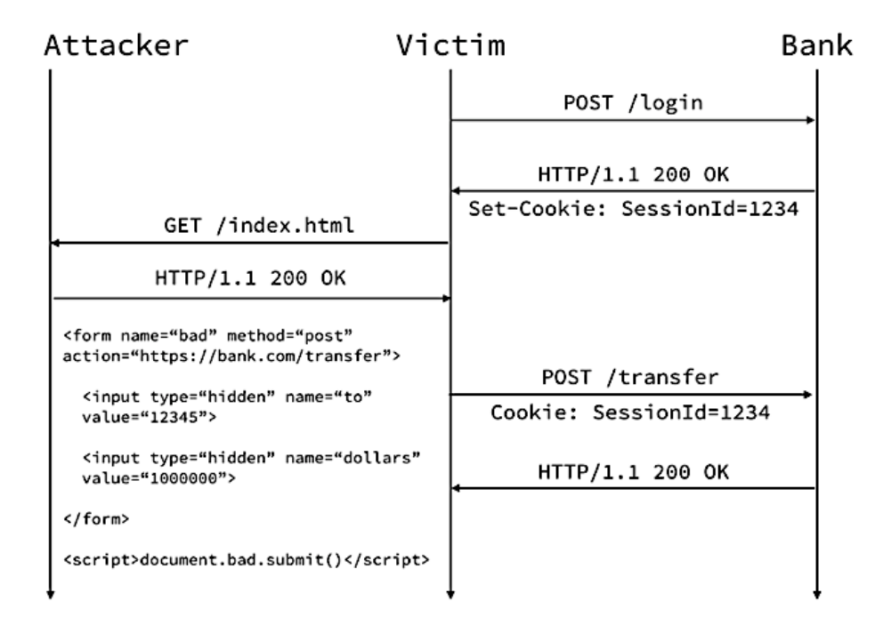

## Cross-Site Request Forgery (CSRF) Attack

CSRF (Cross-Site Request Forgery) is a type of attack on website visitors that exploits weaknesses in the HTTP protocol. If a victim visits a site created by an attacker, a request is secretly sent from their behalf to another server (for example, a payment system server) to carry out a malicious operation (for example, transferring money to the attacker's account). For this attack to be successful, the victim must be authenticated on the server to which the request is sent, and this request must not require any confirmation from the user that cannot be ignored or faked by the attacking script.

To prevent this attack, all requests for data state changes should be signed with a special token.

It is important to remember that internal services/administration panels (not directly accessible to the attacker) can also be vulnerable to this attack, so it's important not to forget about their protection.

### Protective Measures

Signing the request with a special token. For this, you can use the [csurf](https://www.npmjs.com/package/csurf) package.

### Task

The fund transfer functionality in the provided code is vulnerable to a CSRF attack. Fix the vulnerability without changing the program's behavior. The token value should be passed as the ``_csrf`` parameter in the body of the POST request.

### Additional Information
* http://www.owasp.org/index.php/Cross-Site_Request_Forgery_%28CSRF%29
